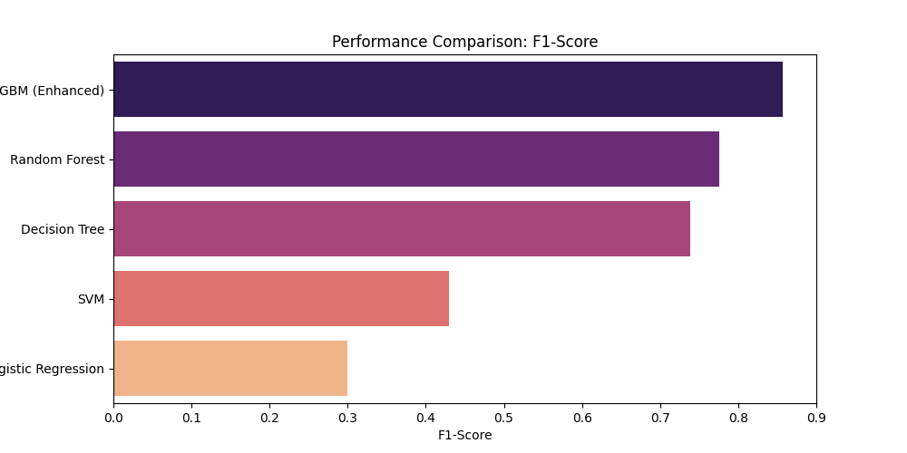
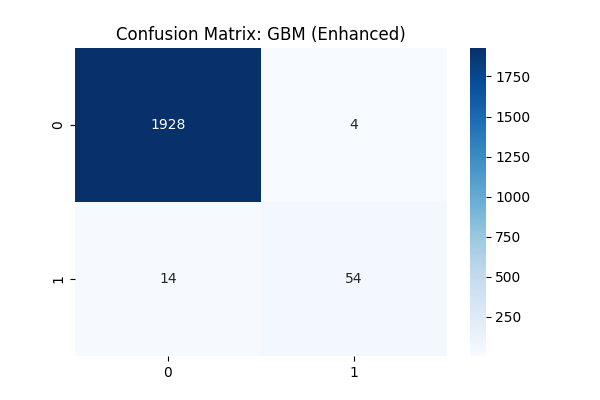

# 🛠️ Machine Failure Prediction using ML

This project implements a machine learning-based predictive maintenance system to detect and classify machine failures using sensor data. Multiple classification models are trained and evaluated, and the best-performing model is selected based on performance metrics.

The goal is to minimize unexpected machine breakdowns by predicting failures in advance, helping improve reliability and maintenance planning in industrial systems.

---

## 📌 Features
- Data preprocessing and feature engineering  
- Training of multiple ML models  
- Model comparison using Accuracy, Precision, Recall, and F1-score  
- Confusion matrix visualization  
- Best-performing model saved for reuse  
- Fault type classification  

---

Machine-Failure-Prediction-using-ML/
│
├── data/
│   └── ai4i2020.csv           # Raw Sensor Dataset
├── assets/
│   └── label_encoder.pkl      # Encoder for categorical machine types
├── model.ipynb                # Research, EDA, and Model Comparison
├── champion_model.pkl         # Trained GBM Brain (Joblib)
├── model_comparison.png       # Visualization of F1-Scores
├── winner_confusion_matrix.png # Confusion Matrix for GBM
├── requirements.txt           # Project dependencies
└── README.md                  # Project Documentation


---

## 🧠 Dataset
The dataset is based on the **AI4I 2020 Predictive Maintenance Dataset**, consisting of 10,000 samples of machine sensor data.

### Input Features:
- Air temperature  
- Process temperature  
- Rotational speed  
- Torque  
- Tool wear  

### Target:
- Failure Type (Normal / Fault)

---

## ⚙️ Models Trained
- Logistic Regression  
- Decision Tree  
- Random Forest  
- Support Vector Machine (SVM)  
- Gradient Boosting Machine (Enhanced)

---

## 📊 Model Performance

### 📈 F1-Score Comparison


---

## 🧪 Classification Metrics

| Model               | Accuracy | Precision | Recall | F1-Score |
|---------------------|----------|-----------|--------|----------|
| Logistic Regression | 0.8600   | 0.1807    | 0.8824 | 0.3000   |
| Decision Tree       | 0.9820   | 0.7581    | 0.6912 | 0.7231   |
| Random Forest       | 0.9885   | 0.9592    | 0.6912 | 0.8034   |
| SVM                 | 0.9205   | 0.2844    | 0.8824 | 0.4301   |
| GBM (Enhanced)      | 0.9910   | 0.9310    | 0.7941 | 0.8571   |

---

## 🏆 Best Model
**Gradient Boosting Machine (Enhanced)** achieved the highest F1-score and overall performance.

Saved model:
champion_model.pkl


---

## 🧾 Confusion Matrix (Best Model)


### Interpretation:
- True Negatives: 1928  
- False Positives: 4  
- False Negatives: 14  
- True Positives: 54  

This indicates strong performance with very low false alarms and missed failures.

---

## 🚀 How to Run the Project

1. Clone the repository:
```bash
git clone https://github.com/geeky-may/Machine-Failure-Prediction-using-ML.git
cd Machine-Failure-Prediction-using-ML
Install dependencies:

pip install -r requirements.txt
Open the notebook:

jupyter notebook model.ipynb
Run all cells to train and evaluate models.
